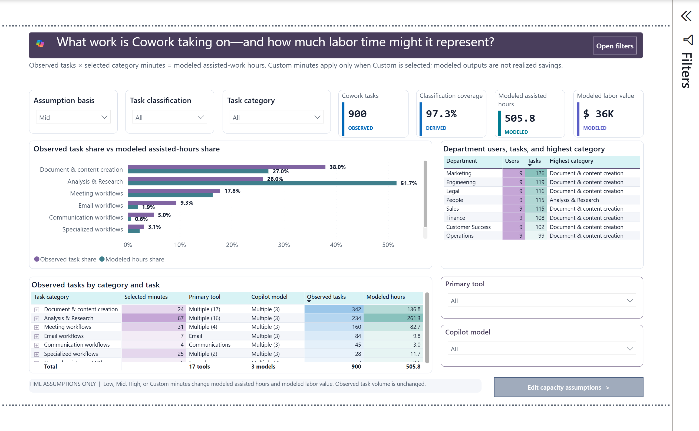

# Cowork Adoption Intelligence

> **Turn Microsoft 365 Copilot Cowork activity into adoption, work-pattern,
> maturity, category-user, and modeled assisted-time evidence.**

[](CHANGELOG.md)
[](src/)
[](SECURITY.md)

> [!IMPORTANT]
> **Template status: Testing.** Validate source coverage, definitions,
> assumptions, and rendered results before using the report for production
> decisions.

Cowork Adoption Intelligence V6 is a data-free Power BI template for Cowork
administrators, adoption leaders, and enablement teams. It directly reads the
paired CSV outputs from one PAX Cowork Adoption run:

- Purview interactions
- Entra users, organization, and Microsoft 365 Copilot licensing

No Python preprocessing or 13-file entity build is required for V6.



## Start in three steps

1. Generate the paired CSV files with the
  [PAX workflow](SETUP.md#generate-the-files-with-pax), or obtain them from an
  authorized PAX collection owner.
2. Open
   [`Cowork Adoption Intelligence V6.pbit`](Cowork%20Adoption%20Intelligence%20V6.pbit)
   and provide:
   - `Cowork Adoption Purview File`
   - `Cowork Adoption Users File`
3. Select **Load**, then reconcile the report totals with the source files.

Both parameters accept a full local path, SharePoint HTTPS URL, or OneLake URL.
See [SETUP.md](SETUP.md) for supported path forms and validation steps.

## What the report answers

| Page | Business question |
| --- | --- |
| **Cowork Adoption Scorecard** | What is the current adoption position, and which evidence page should I inspect next? |
| **Weekly Adoption & Usage** | Are active users and task activity growing, recurring, or flattening? |
| **Scalable Work Patterns** | Which observed task patterns repeat, and where are modeled assisted hours concentrated? |
| **Demand & Capacity Scenario** | How does observed task demand compare with modeled assisted-work hours under editable assumptions? |
| **Adoption Maturity** | Are users progressing from first use toward sustained delegation and automation? |
| **Category Users** | Which users and departments show observed activity in a selected work category? |
| **Capacity Assumptions** | Which customer-controlled category minutes drive modeled hours and labor value? |
| **Adoption Metric Guide** | How is each metric defined, and what are its interpretation limits? |

Category-user evidence supports enablement outreach; it is not an employee
performance, aptitude, promotion, compensation, or disciplinary rating.
Modeled assisted hours and labor value are scenarios, not realized savings,
available headcount capacity, forecasts, or financial audits.

## Required data path

| Parameter | Required | Expected file |
| --- | --- | --- |
| `Cowork Adoption Purview File` | **Yes** | PAX Purview Cowork interactions CSV |
| `Cowork Adoption Users File` | **Yes** | Paired PAX Entra users, organization, and licensing CSV |

Use the two files from the same PAX run. Keep them outside the Git working tree
and in an approved protected location.

## Release kit

| Resource | Path |
| --- | --- |
| Public, data-free Power BI template | [`Cowork Adoption Intelligence V6.pbit`](Cowork%20Adoption%20Intelligence%20V6.pbit) |
| Editable PBIP source | [`src/Cowork Adoption Intelligence V6.pbip`](src/Cowork%20Adoption%20Intelligence%20V6.pbip) |
| Page renders | [`images/report-pages/`](images/report-pages/) |
| Interpretation guide | [`INTERPRETATION_GUIDE.md`](INTERPRETATION_GUIDE.md) |
| Release evidence | [`docs/RELEASE_CHECKLIST.md`](docs/RELEASE_CHECKLIST.md) and [`docs/RELEASE_VERIFICATION.json`](docs/RELEASE_VERIFICATION.json) |
| Historical templates | [`release/archive/`](release/archive/) |

The automation and fabricated sample ZIPs under `release/` belong to the
previous preprocessed-entity path. They remain for existing deployments and are
not the V6 ingestion path.

## Repository structure

```text
Cowork Adoption Intelligence V6.pbit
docs/
images/report-pages/
release/
  archive/
src/
  Cowork Adoption Intelligence V6.pbip
  Cowork Adoption Intelligence V6.Report/
  Cowork Adoption Intelligence V6.SemanticModel/
```

## Security and privacy

The distributable template contains no imported customer data. It carries the
tenant **Public** sensitivity label without encryption and includes the
Desktop-generated `SecurityBindings` stream. Do not strip or hand-edit package
streams.

Production PAX exports and refreshed reports can contain personal, tenant,
resource, and business information. Keep them outside the repository, restrict
access, and never attach them to public issues or pull requests. Read
[SECURITY.md](SECURITY.md) before using production data.

## Interpretation boundaries

- Purview coverage depends on licensing, retention, permissions, and emitted
  fields.
- Task duration is not measured human attention.
- Category classifications are analytical groupings, not policy approval.
- Modeled assisted hours equal observed tasks multiplied by selected category
  minutes; they are not realized savings or available workforce capacity.
- Small cohorts and incomplete periods should be treated as directional.

See [INTERPRETATION_GUIDE.md](INTERPRETATION_GUIDE.md) for page-by-page reading
order, actions, and guardrails.

## Release status

The current release is **6.0.0-testing**. Review the
[changelog](CHANGELOG.md), [release checklist](docs/RELEASE_CHECKLIST.md), and
[verification manifest](docs/RELEASE_VERIFICATION.json) before distribution.

For problems, open a
[GitHub issue](https://github.com/microsoft/Cowork-Adoption-Intelligence/issues)
without attaching tenant exports, credentials, customer identifiers, or
identifiable screenshots.

## License

This project is licensed under the [MIT License](LICENSE).

## Trademarks

This project may contain Microsoft trademarks or logos. Use of Microsoft
trademarks or logos must follow
[Microsoft's Trademark and Brand Guidelines](https://www.microsoft.com/legal/intellectualproperty/trademarks).
Modified versions must not cause confusion or imply Microsoft sponsorship.
